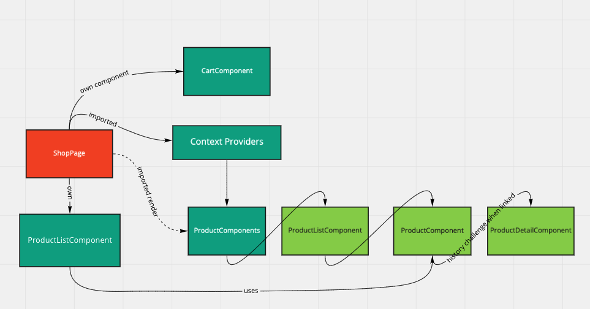

# mfe-barcamp-react

Micro Frontend using React

## Dev Setup

Run in each folder:

- `yarn install && yarn start`

## Build packages

- `yarn build`

## Topics covered

- Using a framework (React)
- Routing
- Shared dependencies
- Shared data between components that are isolated (context)
- ...

## Packages

- ProductComponents (ProductComponent, ProductDetailComponent, ProductListComponent)
- Context Providers (CartContext)
- ShopPage (CartComponent, ProductListComponent)
- CartComponent (WIP --> can be abstracted if wanted, currently available for testing but the page uses its own for now)

